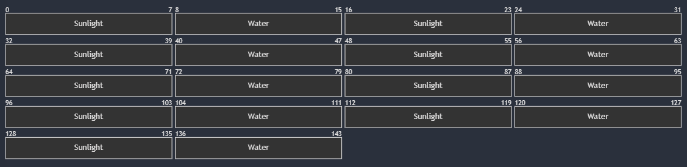

# Space Farm (CMPM-121-Final-Game)

Space Farm is a simple farming sim about trying to figure out the necessary conditions for growing different plants on a planet in outer space. It is partially inspired by the film "The Martian".

## Devlog Entry - [11/15/2024]

## Introducing the team

Tools Lead: Ryo Safadi

Engine Lead: Mitchell Tai

Design Co-Leads: Arno Wu, Patrick James Alcantara

## Tools and materials

1. We would like to build the game using the Phaser Library. We think that Phaser is a good choice for the 2D grid-based game we plan to make, and we all have experience developing with Phaser. We would also get the chance to practice and apply what we learned from both CMPM120 and CMPM121.

2. We will use JavaScript for the programming language, and JSON as the data language since we are planning to use Phaser. This programming language and data language are well-supported by Phaser, which is the main reason why we chose them.

3. We will use VScode for this project, and maybe Aseprite for creating visual assets. We all have experience with VScode and some of its tools, so it seemed like the best choice for an IDE. As for Aseprite, it seems like a relatively straightforward yet valuable tool, so we want to learn more about it.

4. For an alternate platform, we plan to switch our programming language from Javascript to Typescript, but we will continue to use the Phaser framework.

## Outlook

For this game project, our goal is to try to create a 2D grid on the surface of a planet that “exists” in 3D space. This means that the player will only see a portion of the planet that can be represented in two dimensions, but the planet can also “spin” so that the player can explore more of it, one chunk at a time. We plan to do this by creating the illusion of a third dimension through visuals. This will most likely be the hardest part of our project to implement, but we believe that it will help pique our players’ interests if successful. This challenge will also give us the chance to improve our collaboration skills and put what we’ve learned in CMPM 120 and 121 into practice.

#

## Devlog Entry - [12/06/2024]

## How we satisfied the F0 software requirements

1. [F0.a] You control a character moving over a 2D grid.

We created a grid of individual grid cell instances so that we can reference each grid cell based on its position within the grid. We then added a player character that can be controlled using the arrow keys. This character moves discretely between the gridcells, moving from grid cell to adjacent grid cell depending on which arrow key is was pressed.

2. [F0.b] You advance time manually in the turn-based simulation.

We have implemented a "next turn" button that advances time by one turn in the simulation each time it is pressed. This affects the sunlight and water levels of the grid cells, as well as the growth levels of any plants on the grid that have met their growth conditions.

3. [F0.c] You can reap or sow plants on grid cells only when you are near them.

We have buttons that, when clicked, add a plant seed to the player's inventory. The player can then click on a grid cell and select the seed they wish to plant from their inventory. When a plant reaches level 3, it can be harvested and sold to progress toward the player's objective.

4. [F0.d] Grid cells have sun and water levels. The incoming sun and water for each cell is somehow randomly generated each turn. Sun energy cannot be stored in a cell (it is used immediately or lost) while water moisture can be slowly accumulated over several turns.

Each grid cell has its own sun and water values that are randomly generated each turn. Both traits are randomized to a value between 0 and 10, and do not carry over between turns. Plants can only grow on cells that have met or exceeded a certain sun and water threshold.

5. [F0.e] Each plant on the grid has a distinct type (e.g. one of 3 species) and a growth level (e.g. “level 1”, “level 2”, “level 3”).

We have 3 different types of plants that each have different spatial rules for growth. The will start at level 1 when planted and can grow up to level 3, at which point they can be harvested and sold to progress toward the player objective.

6. [F0.f] Simple spatial rules govern plant growth based on sun, water, and nearby plants (growth is unlocked by satisfying conditions).

Plants can grow if the grid cell they were planted on has met or exceeded the sun and water threshold, and if their spatial conditions have also been met. One type of plant will grow if no other plants are adjacent to it, another will grow if exactly 1 other plant is adjacent to it, and the third will grow if 2 or more plants are adjacent to it.

8. [F0.g] A play scenario is completed when some condition is satisfied (e.g. at least X plants at growth level Y or above).

Once the player has sold 5 plants, which require the player to grow plants to level 3 and then harvest them, they will have completed the play scenario.

## Reflection

Throughout completing the F0 requirements, our team members' roles stayed pretty much the same as we initially defined them, though we would ocassionally shuffle role tasks around. For our tools and materials, though we stuck with Phaser as our framework and JavaScript as our programming language, we switched from including the Phaser library file directly in our project folder to installing it with npm, as importing Phaser once installed with npm worked better with our ES Module code organization. We also switched from using the Live Server vscode extension to Vite for testing, as the Live Server extension wasn't working as intended.

#

## Devlog Entry - [12/08/2024]

## How we satisfied the F0 software requirements

1. [F0.a] You control a character moving over a 2D grid.

We created a grid of individual grid cell instances so that we can reference each grid cell based on its position within the grid. We then added a player character that can be controlled using the arrow keys. This character moves discretely between the gridcells, moving from grid cell to adjacent grid cell depending on which arrow key is was pressed.

2. [F0.b] You advance time manually in the turn-based simulation.

We have implemented a "next turn" button that advances time by one turn in the simulation each time it is pressed. This affects the sunlight and water levels of the grid cells, as well as the growth levels of any plants on the grid that have met their growth conditions.

3. [F0.c] You can reap or sow plants on grid cells only when you are near them.

We have buttons that, when clicked, add a plant seed to the player's inventory. The player can then click on a grid cell and select the seed they wish to plant from their inventory. When a plant reaches level 3, it can be harvested and sold to progress toward the player's objective.

4. [F0.d] Grid cells have sun and water levels. The incoming sun and water for each cell is somehow randomly generated each turn. Sun energy cannot be stored in a cell (it is used immediately or lost) while water moisture can be slowly accumulated over several turns.

Each grid cell has its own sun and water values that are randomly generated each turn. Both traits are randomized to a value between 0 and 10, and do not carry over between turns. Plants can only grow on cells that have met or exceeded a certain sun and water threshold.

5. [F0.e] Each plant on the grid has a distinct type (e.g. one of 3 species) and a growth level (e.g. “level 1”, “level 2”, “level 3”).

Except for using strings to represent the different plants, we added 3 different sprite sheets for the types and their respective levels.

6. [F0.f] Simple spatial rules govern plant growth based on sun, water, and nearby plants (growth is unlocked by satisfying conditions).

Plants can grow if the grid cell they were planted on has met or exceeded the sun and water threshold, and if their spatial conditions have also been met. One type of plant will grow if no other plants are adjacent to it, another will grow if exactly 1 other plant is adjacent to it, and the third will grow if 2 or more plants are adjacent to it.

8. [F0.g] A play scenario is completed when some condition is satisfied (e.g. at least X plants at growth level Y or above).

Once the player has sold 5 plants, which require the player to grow plants to level 3 and then harvest them, they will have completed the play scenario.

## How we satisfied the F1 software requirements

1. [F1.a] The important state of your game's grid must be backed by a single contiguous byte array in AoS or SoA format. If your game stores the grid state in multiple format, the byte array format must be the primary format (i.e. other formats are decoded from it as needed).

The Grid class uses a single contiguous dataArray to store grid state, with each cell represented by two bytes (sunlight and water).

2. [F1.b] The player must be able to manually save their progress in the game. This must allow them to load state and continue play another day (i.e. after quitting the game app). The player must be able to manage multiple save files/slots.

We have implemented manual save functionality using saveGame, which prompts the player for a save slot name and serializes the game state into localStorage. 

3. [F1.c] The game must implement an implicit auto-save system to support recovery from unexpected quits. (For example, when the game is launched, if an auto-save entry is present, the game might ask the player "do you want to continue where you left off?" The auto-save entry might or might not be visible among the list of manual save entries available for the player to load as part of F1.b.)

We have implemented auto-save functionality using autoSaveGame, which updates the auto_save entry in localStorage every time the game state changes. On launch, the game checks for an auto-save and prompts the player to load it if available.

4. [F1.d] The player must be able to undo every major choice (all the way back to the start of play), even from a saved game. They should be able to redo (undo of undo operations) multiple times.

The undo and redo systems store game states in stacks. The createUndoButton and createRedoButton allow players to navigate game states interactively. States are serialized before being pushed into the stacks, ensuring they represent full game states.

## Reflection

We shed a lot of gameplay and art aspects of the design for time reasons and focused more on completing the requirements and the basic gameplay experience. We basically kept the original role and tool use. Initially, we viewed Undo/Redo system as a secondary feature, but it became a core mechanic that encourages experimentation. This required us to think more critically about how players interact with game states and how to visually convey the ability to undo/redo. Also, we tried to add more colorful sprites to give the player positive feedback visually. 

#

## Devlog Entry - [12/09/2024]

## How we satisfied the F3 software requirements

## F0 + F1 + F2

No major changes were made.

## Internationalization

We have added a translations.json file that stores translations for the text in our game in 3 different languages. In our main project files, we reference this data based on the language that the player has selected in the language menu. If we wanted to add support for another language or add more translations to an existing language, we would just have to modify the text in the json file and update the language menu if adding a new language.

## Localization

Our game supports English, Chinese, and Arabic. For the translations, we first compiled all the english text in our game and added it to a JSON object. We then ran that object through chatGPT to translate it to both Chinese and Arabic while maintaining the object structure. The player selects the language they want to use from the game's main menu, which has a language tab.

## Mobile Installation

For installing the game on a mobile device, Mitchell already had prior experience adding mobile download support to another app, so he transferred that knowledge to this project.

## Reflection

As this was the final stretch for the project, we didn't make any changes to our team roles or our toolset, as there wasn't a need or a major benefit in doing so.
